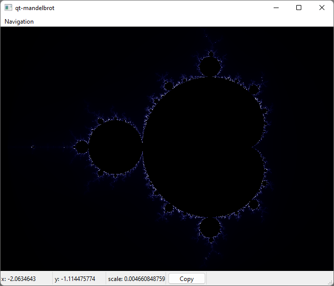
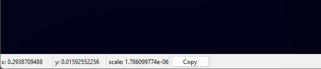
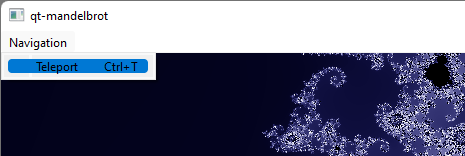
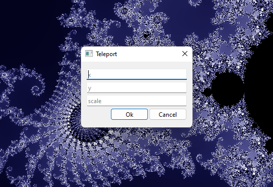

# Mandelbrot
Данный проект визуализирует псевдомножество Мандельброта. Другими словами чем ярче отрисовывается точка, тем в большей степени она близка к множеству точек Мандельброта

Палитра множества специально продумана таким образом, чтобы оно по виду походило на звёздное небо.

## Управление
1) Перемещение реализуется c помощью удержания и перемещения мышки
2) Масштаб изменяется с помощью колёсика мыши

### Дополнительные возможности
1) Сохранение положения. На нижней панели указаны координаты вашего текущего положения и масштаб. При необходимости Вы можете сохранить понравившееся положение с помощью кнопки *Copy*

2) Телепортация. Если Вы сохранили понравившееся вам положение отображения на этом множестве, то вы можете "телепортироваться" в нужную область. Для этого можете перейти в *Инструменты -> Телепортация* или воспользоваться указанным там сочетаниям клавиш.

# Идеи для развития
1. **Ускорение**.
    1. **Новое - хорошо забытое старое**. Довольно большие затраты вычислительной мощности уходят на отрисовывание новой картинки. Поэтому можно было бы не отрисовывать новую картинку с нуля, а пользоваться ранее отправленными данными предыдущих изображения для отрисовки следующего.
    2. **Оптимизация памяти**. Мне кажется, неплохим решением по ускорению отрисовки может являться резервирование памяти под новые изображение. Это избавит нас от частого и не очень оптимального использования `new` при аллокации памяти под изображение. Резерватором может служить небольшой пулл пространства пустых картинок.
4. **Удобная телепортация.** Первоочередной является добавление более удобного функционала для сохранения и перемещения к отмеченной области. Для этого я бы добавил окно со списком сохранённых положении и телепортации к ним по нажатию на название области
5. **Кастомизация**. Формы узоров завораживают, но было бы лучше ещё определять переходы цветов. Для этого можно было бы добавить палитру с помощью каторой изменять градиенты перехода от одного цвета к другому и интенсивность изменения.
